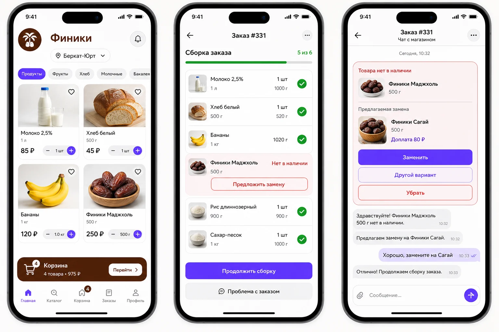
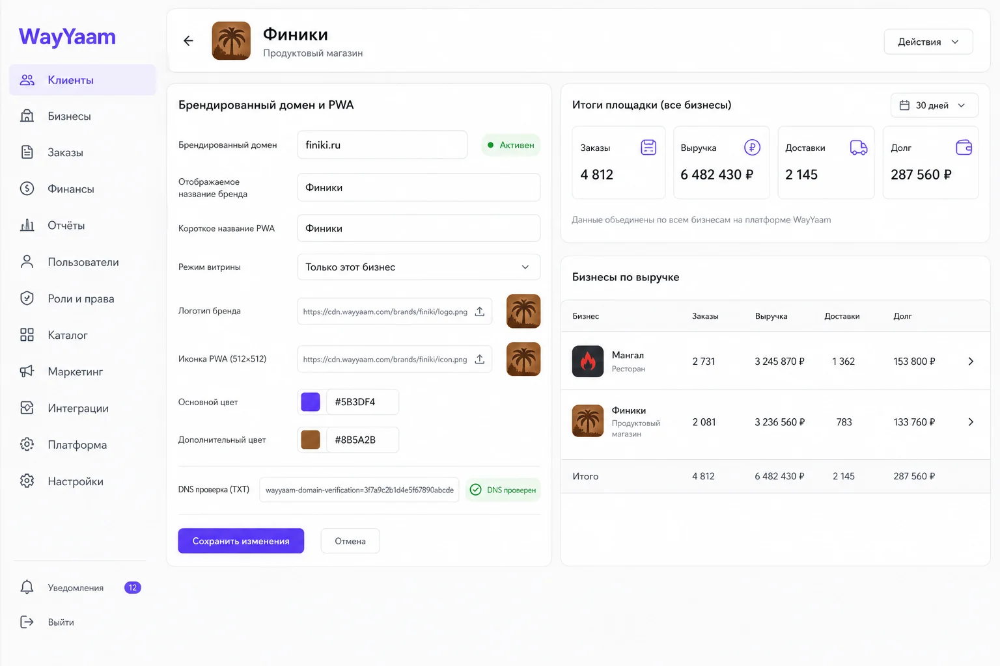

# Техническое задание и фактическая архитектура multi-business WayYaam

**Статус:** реализация подготовлена в feature-ветке; production-миграции, DNS и публикация не выполнялись
**Базовая версия:** `origin/main` @ `c669d902be3044ca10dde03218387fca8a2aba31`
**Цель первого релиза:** добавить продуктовый магазин как полноценный тип бизнеса, не изменив наблюдаемое поведение действующих ресторанов, клиентов, суперадмина и водителей.

## 0. Принятое решение и граница текущего этапа

Выбрано безопасное расширение, а не массовое переименование. `catalogs` остаётся tenant-ядром, существующий ресторанный путь — compatibility-слоем, а универсальность задаётся реестром `business_types`, нейтральными TypeScript-моделями и отдельными модулями catalog/fulfillment/conversation/branding. Это позволяет включить grocery сейчас и позднее добавлять flowers, gifts и household без копирования backend.

В feature-ветке подготовлены и проверены следующие вертикальные срезы:

| Блок | Фактически подготовлено | Граница текущего этапа |
|---|---|---|
| Типы бизнеса | Реестр `business_types`, выбор типа суперадмином, активный `grocery`; flowers/gifts/household отключены, pharmacy заблокирована compliance-статусом | Новые типы включаются только после шаблона и приёмочных тестов |
| Каталог | SKU, штучные и весовые товары, минимальный шаг, остаток, варианты, неизменяемые снимки параметров в заказе | Сложные акции и склад по филиалам отложены |
| Команда магазина | Tenant-роли manager/picker, права, назначение заказа, принятие, таймаут и fallback владельцу | Планировщик может позже вызывать уже подготовленную RPC эскалации |
| Сборка и замены | Чек-лист, фактический вес, отсутствие, предложение замены, решение клиента, чат, корректировка суммы, realtime/push-события | Production push требует опубликованных функций и проверки на устройствах |
| Доставка | Существующая инфраструктура водителей принимает заказы разных `business_type` | Географический диспетчер филиалов и зон не добавлялся |
| White-label | Проверенный hostname, exclusive-витрина, branding, manifest/PWA, сохранение origin в push deep link | DNS, TLS, Edge Function и каждый реальный origin активируются отдельно |
| Суперадмин | Общий список типов/бизнесов, настройка white-label, общая статистика заказов/доставки/долга с compatibility alias `restaurantStats` | Полноценный неизменяемый ledger остаётся отдельным финансовым этапом |

Удаление или перенос production-данных не требуется. Миграции являются additive/expand и пока существуют только в репозитории.

## 1. Продуктовая цель

WayYaam должен обслуживать через одну платформу и один backend разные типы бизнеса:

- ресторан;
- кофейня;
- кондитерская;
- продуктовый магазин;
- цветочный магазин;
- магазин подарков;
- хозяйственный магазин;
- аптека после отдельной проверки разрешений и ограничений;
- другие розничные типы без копирования приложения.

Клиент выбирает населённый пункт и видит доступные ему опубликованные бизнесы. Каждый бизнес получает свой шаблон и терминологию, но каталог, клиентская идентичность, заказ, доставка, аудит и финансовая отчётность остаются общими.

## 2. Неприкосновенные свойства существующей платформы

1. Действующий ресторанный заказ сначала создаётся в Supabase, получает реальный `orderId`, а затем может быть открыт по статусной или WhatsApp-ссылке.
2. Сохраняются submit lock, idempotency key и совместимость со старыми RPC.
3. Существующие restaurant/coffee_shop/confectionery каталоги продолжают открываться, оформлять заказ и передавать доставку водителю.
4. Выход пользователя остаётся явным действием; новые роли не должны ломать разделение сессий клиента, бизнеса, водителя и суперадмина.
5. Ни один новый тип бизнеса не получает доступ к данным другого каталога.
6. Исторический заказ не меняется вслед за редактированием товара или шаблона.
7. Production-данные не удаляются ради переименования. Тестовые данные изолируются через `is_test_order` и удаляются только целевым test-reset.

## 3. Канонический словарь

| Канонический термин | Значение | Старое ресторанное отображение |
|---|---|---|
| `business_type` | Тип поведения и шаблона | restaurant / coffee_shop / confectionery |
| `catalog` | Tenant, витрина и владелец ассортимента | ресторанный каталог |
| `business` | Презентационное представление каталога | ресторан/кофейня/магазин |
| `product` | Универсальная продаваемая позиция | блюдо/товар |
| `catalog_member` | Сотрудник конкретного бизнеса | владелец/администратор ресторана |
| `fulfillment` | Выполнение заказа до передачи | приготовление или сборка |
| `delivery` | Доставка готового заказа | существующая доставка WayYaam |
| `driver` | Общий водитель платформы | без изменения |

Физический массовый rename `restaurant_*` не является условием запуска. Старые таблицы и RPC остаются compatibility-слоем; новый код использует канонические термины и адаптеры.

## 4. Реестр типов бизнеса

Фиксированный CHECK из трёх значений заменён registry-backed связью с `business_types`:

### `business_types`

- `code` — стабильный машинный ключ;
- `label` — название для суперадмина;
- `availability`: `active`, `disabled`, `compliance_blocked`;
- `sort_order`;
- `created_at`, `updated_at`.

`catalogs.business_type`, `catalogs.template_type` и соответствующие поля client/business account ссылаются на этот реестр внешними ключами. Презентационные подписи и возможности пока находятся в типизированном registry frontend; это осознанный промежуточный шаг.

### Будущее расширение: `business_capabilities`

На текущем этапе поведение задаётся проверенным шаблоном и реестром приложения. При росте числа типов его следует перенести в справочник возможностей:

- `supports_weight`;
- `supports_substitutions`;
- `requires_picking`;
- `supports_staff_assignment`;
- `supports_delivery`;
- `supports_pickup`;
- `supports_dine_in`;
- `supports_preorder`;
- `regulated_commerce`.

### Будущее расширение: `business_type_capabilities`

Это нормализованное соответствие типа и возможностей потребуется, когда capabilities начнут меняться независимо от релиза приложения. Включение новой возможности должно проверяться доверенным серверным контуром, а не только скрытием кнопки.

| Тип | Вес | Замены | Сборка | Сотрудники | Доставка | Столики | Регулируемая торговля |
|---|---:|---:|---:|---:|---:|---:|---:|
| restaurant | иногда | нет | приготовление | да | да | да | нет |
| coffee_shop | нет | нет | приготовление | да | да | возможно | нет |
| confectionery | да | нет | производство | да | да | возможно | нет |
| grocery | да | да | комплектация | да | да | нет | частично |
| flowers | нет | да | комплектация | да | да | нет | нет |
| gifts | нет | да | комплектация | да | да | нет | нет |
| household | возможно | да | комплектация | да | да | нет | частично |
| pharmacy | возможно | ограниченно | комплектация | да | ограниченно | нет | да |

Добавление типа через суперадмин означает выбор заранее проверенного типа и шаблона. Создание произвольной схемы, permission или юридически регулируемого типа через обычную форму запрещено.

## 5. Границы модулей

### Platform Core

- бизнес-типы и capabilities;
- каталоги и membership;
- единая клиентская идентичность;
- аудит и feature flags.

### Catalog

- категории;
- товары;
- изображения;
- варианты/SKU;
- доступность и простой остаток.

### Fulfillment

- ресторанное приготовление через существующий адаптер;
- grocery/retail picking;
- фактическое количество и вес;
- назначение сотрудника;
- замены.

### Conversation

- чат строго внутри заказа;
- системные карточки замен;
- сообщения клиента и сотрудника;
- push deep link;
- аудит решений.

### Delivery

- существующие `deliveries` и `drivers`;
- нейтральные подписи точки получения;
- передача только завершённого fulfillment.

### Finance and Audit

- серверные order totals;
- начисления платформы и водителя;
- возвраты и сторно;
- общая суперадминская сверка для всех типов бизнеса.

### Branding

- тема каталога;
- white-label hostname;
- manifest, иконки и title;
- единая платформа и SSO.

## 6. Tenant и права доступа

`catalogs` остаётся текущим tenant-ядром. На первом этапе один `catalog` равен одному бизнесу и одной витрине. Отдельный `merchant` над каталогами добавляется только при фактическом появлении сетей, нескольких брендов или единого юридического договора.

Каждая новая строка обязана иметь неизменяемый `catalog_id` напрямую либо однозначно выводить его через защищённую связь.

### Базовые роли membership

- `owner`;
- `admin`;
- `editor`;
- `viewer`.

### Рабочие permission-пресеты

- `manager`;
- `picker`;
- `catalog_editor`;
- `order_viewer`.

Не следует добавлять глобальную роль `grocery_picker` в `users.role`. Сборщик является сотрудником конкретного каталога.

### Permission keys

- `catalog.edit`;
- `staff.manage`;
- `orders.view`;
- `orders.assign`;
- `orders.accept`;
- `orders.pick`;
- `orders.propose_substitution`;
- `orders.pack`;
- `orders.handoff`.

`owner` и `admin` получают необходимые разрешения по умолчанию. `picker` видит только нужные для сборки клиентские данные. Авторизация никогда не опирается на редактируемый `user_metadata`.

## 7. Создание бизнеса суперадмином

Одна атомарная операция должна:

1. проверить platform admin;
2. проверить активность `business_type` и шаблона;
3. создать или связать Auth user владельца;
4. создать client/business account;
5. создать draft catalog;
6. создать owner membership;
7. применить разрешённые capabilities и defaults шаблона;
8. создать запись аудита;
9. вернуть `catalog_id`, slug и маршрут первого входа.

Частично созданный бизнес без владельца недопустим. Неизвестный, disabled или регулируемый без проверки тип отклоняется сервером.

## 8. Продуктовый каталог

Существующие `categories`, `products`, `product_images`, tags и option groups сохраняются.

### Единицы продажи

- `piece` — штуки;
- `weight` — вес;
- `volume` — объём, позднее;
- базовые единицы: `piece`, `gram`, `milliliter`.

Для товара определяются:

- `sale_unit`;
- существующая цена `price` в минимальных денежных единицах;
- `price_basis_quantity`, например цена за 1000 г;
- `minimum_quantity`;
- `quantity_step`;
- `sku` и optional `barcode`;
- `stock_quantity` и существующий признак неограниченного остатка.

GS1 различает fixed и variable measure items; для variable measure идентификация должна учитывать товар и переменное количество/цену. Поэтому вес не должен кодироваться как обычное целое `quantity`.

### Запрос и фактическая комплектация

`order_items` сохраняет намерение клиента и фактический результат без отдельной дублирующей таблицы:

- товар и снимок;
- `requested_quantity`;
- единицу;
- цену-базу;
- ожидаемую сумму.
- `fulfilled_quantity`;
- `fulfillment_state`: `pending`, `picked`, `unavailable`, `substitution_pending`, `substituted`, `removed`;
- связи `replaces_order_item_id` и `source_substitution_id` для замены.

Фактическая сумма всегда вычисляется на сервере.

## 9. Назначение и fallback сотрудника

### `order_work_assignments`

- `order_id`, `catalog_id`;
- `assignee_user_id`;
- `state`: `offered`, `accepted`, `declined`, `expired`, `superseded`;
- `offered_at`, `expires_at`, `accepted_at`;
- `assigned_by`;
- `version`, `source`, `escalation_level`.

Отдельная append-only таблица `order_work_assignment_events` сохраняет предложения, принятия, отказы, истечения и fallback владельцу.

Правила:

1. Без активного сборщика заказ получает owner/admin.
2. При наличии основного сборщика заказ предлагается ему.
3. Принятие атомарно: победить может только один сотрудник.
4. Непринятый до `expires_at` заказ эскалируется owner/admin.
5. Push является уведомлением, но не источником истины.
6. Любой открытый или просроченный заказ остаётся видимым владельцу.

## 10. Сборка заказа

Для MVP отдельный глобальный `fulfillment_status` намеренно не добавлен: состояние каждой позиции находится в `order_items.fulfillment_state`, а общий ресторанный `orders.status` остаётся совместимым. Целевой order-level workflow упаковки/передачи должен быть добавлен позднее независимо от ресторанного статуса:

- `pending`;
- `assigned`;
- `picking`;
- `awaiting_customer`;
- `picked`;
- `packed`;
- `ready_for_handoff`;
- `completed`;
- `cancelled`.

Существующий ресторанный статус не расширяется десятками grocery-значений. Адаптер переводит fulfillment в верхнеуровневое состояние заказа.

Подготовленный интерфейс позволяет сборщику принять назначение, пройти чек-лист, ввести фактический вес и зафиксировать отсутствие/замену. Жёсткая серверная блокировка передачи водителю до `ready_for_handoff` относится к следующему order-level fulfillment этапу и не должна имитироваться только скрытием кнопки.

## 11. Замены и чат

Практика крупных grocery-сервисов подтверждает полезную модель: клиент может заранее или во время сборки выбрать конкретную замену, лучший вариант или удаление/refund; после начала сборки доступен чат, а изменения показываются в текущем заказе.

### `order_substitution_requests`

- исходная `original_order_item_id`;
- предлагаемый product/variant;
- снимки названия, изображения, единицы и цены;
- исходная и новая сумма;
- `price_delta`;
- автор запроса;
- состояние `pending`, `accepted`, `removed`, `alternative_requested`, `cancelled`;
- версия, timestamps.

### `order_messages`

- `order_id`, `catalog_id`;
- `sender_kind` и проверенный `sender_auth_user_id`;
- `message_type`: `text`, `substitution_offer`, `substitution_decision`, `picking_event`;
- `body`;
- optional `substitution_request_id`;
- created timestamp.

Системные сообщения и решения о замене не редактируются и не удаляются. Обычный текст чата не может самостоятельно изменить цену или состав заказа.

### Поток

1. Сборщик фиксирует отсутствие.
2. Выбирает замену либо запрашивает решение без предложения.
3. Сервер создаёт substitution request и системное сообщение.
4. Push ведёт на существующий публичный маршрут заказа `#/:slug/order/:id?conversation=1`, но не содержит чувствительных данных.
5. Клиент принимает, удаляет товар или просит другой вариант.
6. Versioned RPC проверяет клиента, order ownership, состояние и цену.
7. Fulfillment и итог пересчитываются атомарно.
8. Решение отражается в чате и аудите.

Совмещённый мобильный сценарий ниже показывает визуальное направление для каталога, рабочего места сборщика и решения о замене. Это продуктовый макет на базе текущей дизайн-системы, а не точный production-скриншот.

## 12. Клиентская идентичность

У клиента остаётся один аккаунт WayYaam и одна история заказов независимо от типа бизнеса. White-label домен не создаёт новую учётную запись или отдельный пароль, но browser storage разделён по origin. Поэтому в текущей реализации клиент один раз входит или привязывает существующий аккаунт на каждом новом домене. Бесшовный центральный одноразовый SSO может быть добавлен позже отдельным короткоживущим обменом токена; передавать постоянную сессию через URL нельзя.

Доступ к чату и решению о замене поддерживает Supabase Auth и действующую клиентскую сессию WayYaam. Security-definer RPC сверяет хэш токена `client_account_sessions` и нормализованный телефон владельца заказа. Одного публичного UUID заказа недостаточно.

## 13. Push и Realtime

События:

- новый заказ;
- предложение сотруднику;
- fallback владельцу;
- запрос замены клиенту;
- решение клиента сотруднику;
- готовность заказа;
- назначение/прибытие водителя.

Новые каналы фильтруются по `catalog_id`, `order_id` и при необходимости user id. Широкие подписки на все `order_items`, `deliveries` или `drivers` не копируются в новый модуль.

Push subscription хранит origin и контекст каталога. Нажатие открывает проверенный deep link, затем приложение перечитывает состояние с сервера.

## 14. Финансовая прозрачность

Все типы бизнеса используют общие поля заказа и общую суперадминскую агрегацию, а не отдельные restaurant/grocery отчёты. Подготовленная реализация уже включает grocery в общие итоги заказа, доставки и долга. Следующий финансовый этап должен ввести неизменяемый ledger, описанный ниже, прежде чем появятся сложные комиссии, частичные списания и возвраты.

Минимальные измерения каждого финансового события:

- `order_id`;
- `catalog_id`;
- `business_type_snapshot`;
- `entry_type`;
- `amount_minor` и currency;
- `counterparty_type`: `business`, `driver`, `platform`, `client`;
- `counterparty_id`;
- `is_test`;
- idempotency key;
- source event и timestamp;
- optional reversal reference.

Финансовые записи не удаляются и не переписываются. Ошибка исправляется сторно/reversal. Test-заказы и test-ledger не входят в реальные долги, начисления и показатели.

Суперадмин видит по каждому типу и бизнесу:

- количество заказов;
- клиентский итог;
- сумму товаров;
- доставку;
- комиссию WayYaam;
- начисление бизнесу;
- начисление водителю;
- возвраты/сторно;
- состояние сверки;
- ссылку до исходного заказа и audit trail.

Агрегаты строятся сервером по ledger/order dimensions, а не ограниченным клиентским запросом последних 2000 заказов.

Совмещённый макет управления доменом и общей выручкой показывает целевое расположение элементов. Это визуальное направление, а не точный production-скриншот.

## 15. Другие типы бизнеса

### Flowers / Gifts / Household

Используют тот же catalog + fulfillment + substitutions. Специфичные поля добавляются типизированными расширениями только при реальной потребности: состав букета, текст открытки, упаковка, размеры, срок изготовления.

### Pharmacy

Аптека не может включаться одной сменой шаблона. `regulated_commerce` требует compliance gate. До публикации должны проверяться лицензия и разрешение на дистанционную торговлю; ассортимент, доставка и рецептурные товары требуют отдельных правил. Без такой проверки pharmacy может существовать только как draft/demo тип без приёма реальных заказов.

## 16. White-label

Один frontend и backend обслуживают:

- общий `wayyaam.ru`;
- поддомены WayYaam;
- проверенные собственные домены клиента.

`hostname -> catalog_id` определяет витрину, тему, manifest, иконки и start URL. Публичный lookup возвращает только активный и подтверждённый домен и не позволяет перечислять реестр. Account и order identity остаются WayYaam. Push subscription сохраняет `app_base_url`, поэтому переход из уведомления возвращает клиента на исходный брендированный origin. Для каждого origin отдельно проверяются Auth redirect, passkey, push, service worker и cache isolation.

## 16.1. Промпты визуальных макетов

Макеты сгенерированы встроенным генератором изображений в режиме `ui-mockup`, затем оптимизированы в WebP без изменения исходников генерации.

1. Мобильный storyboard: три экрана WayYaam в существующем светлом мобильном стиле — каталог продуктового магазина «Финики», чек-лист сборщика с весовыми позициями и чат замены с разницей в цене; русский интерфейс, синие CTA, реалистичная иерархия без декоративного редизайна.
2. Desktop superadmin: управление собственным доменом/PWA магазина «Финики» рядом с общей финансовой сводкой всех типов бизнеса; русский интерфейс, текущая бело-синяя дизайн-система, статусы проверки домена и прозрачные суммы заказов, доставки и долга.

## 17. Миграционная стратегия

1. Снять production schema/RLS/function/grant baseline.
2. Зафиксировать characterization tests текущего ресторанного пути.
3. Использовать expand/contract: сначала новые таблицы/колонки и адаптеры, затем перевод читателей, потом optional cleanup.
4. Новые RPC versioned; старые overload/fallback не удаляются до подтверждённой production-миграции.
5. Изменения включаются feature flag только для тестового grocery-каталога.
6. Индексы/constraints валидируются безопасно; рискованные backfill делаются отдельно.
7. Rollback отключает capability/route, не требует удаления заказов.

## 18. Проверка после каждого этапа

Обязательные автоматические ворота:

- focused RED/GREEN tests;
- mutation testing для изменённой domain-логики;
- SQL contract и RLS isolation tests;
- lint;
- typecheck;
- build;
- ресторанные order/idempotency contracts.

Обязательные UI-пути:

- клиент;
- владелец/сотрудник бизнеса;
- суперадмин;
- водитель;
- mobile и desktop критических экранов.

Production write, реальный заказ, push на физическом устройстве, DNS и публикация выполняются только отдельным подтверждённым этапом.

## 19. Исследовательские источники

- GS1, variable measure and loose produce: https://www.gs1.org/standards/fresh-fruit-and-vegetable-traceability-guideline/current-standard
- Instacart replacement choices and shopper chat: https://www.instacart.com/help/section/2114054412
- Instacart replacement instructions: https://www.instacart.com/help/section/2893565984/2735506968
- Walmart substitution and authorization model: https://www.walmart.com/help/article/substitutions-for-store-pickup-and-delivery-items/c8dd3973509b42488da66a362af4666d
- Росздравнадзор, дистанционная торговля лекарствами: https://www.roszdravnadzor.gov.ru/drugs/distancetrade
- ФНС, обязательность и проверяемость чеков: https://www.nalog.gov.ru/rn25/ifns/r25_16/info/16495216/

## 20. Definition of Done всей инициативы

Кодовая подготовка инициативы завершена, но эксплуатационный запуск считается завершённым только когда:

1. grocery создаётся суперадмином атомарно и изолированно;
2. опубликованный магазин виден по текущей географии;
3. клиент оформляет штучный и весовой заказ;
4. сотрудник принимает, собирает и взвешивает;
5. замена проходит через push, чат и атомарное решение;
6. готовый заказ передаётся существующему водителю;
7. владелец и суперадмин видят правильные заказы и начисления;
8. cross-tenant и role tests проходят;
9. действующий ресторанный путь не изменился;
10. новые business types добавляются через реестр и шаблон без копирования backend;
11. pharmacy остаётся заблокированной без compliance approval;
12. все непроверенные external acceptance явно перечислены.
