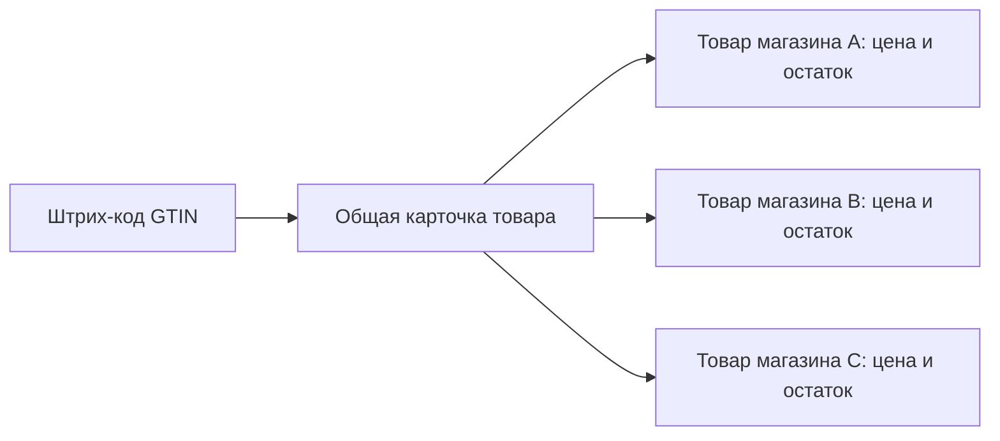

# Общая база товаров

## Главный принцип

Физический товар и предложение магазина — разные сущности.

Общая карточка содержит название, бренд, группу, состав, описание, массу/объём и эталонные фотографии. Запись `products` конкретного каталога содержит цену, остаток, статус публикации, локальную категорию и допустимые переопределения.

Так общая корректировка названия или фотографии не меняет цену и остаток других продавцов.

## Таблицы

| Таблица | Назначение |
| --- | --- |
| `master_categories` | Общая иерархия товарных групп |
| `master_products` | Единая карточка физического товара |
| `master_product_identifiers` | Нормализованные GTIN-8, UPC-A, EAN-13 и GTIN-14 |
| `master_product_media` | Общие фото и будущие результаты удаления фона |
| `product_contributions` | Предложения продавцов и очередь модерации |
| `products` | Предложение конкретного магазина: цена, остаток, публикация |

Связи с существующим каталогом добавлены через `categories.master_category_id`, `products.master_product_id` и `product_images.master_media_id`. Одна общая карточка может быть подключена к магазину только один раз.

## Добавление по штрих-коду

1. Клиент проверяет контрольную сумму и приводит поддерживаемый код к 14-значному ключу.
2. `lookup_shared_product_by_barcode` ищет общую карточку.
3. Если карточка найдена, продавец указывает свою цену и остаток. Общие поля загружаются автоматически.
4. Если карточки нет, `submit_shared_product` создаёт одну запись со статусом `pending` и предложение на модерацию.
5. Короткая транзакционная блокировка по GTIN не позволяет двум магазинам одновременно создать два одинаковых товара.

Форма общей базы не содержит цену и остаток. В ней сохраняются только штрих-код, название, общая группа, описание и фотографии. После импорта в магазин создаётся отдельный черновик, где продавец уже задаёт собственную цену, остаток и статус публикации.

Если нужной общей группы нет, владелец, администратор или редактор магазина может создать её прямо в форме. Название дедуплицируется без учёта регистра, автор и магазин записываются в аудит, а активная группа сразу становится доступна всем магазинам. Суперадминистратор может создавать и архивировать группы из своего раздела.

Внутренние магазинные коды, не проходящие GTIN-проверку, остаются локальными и не загрязняют общую базу.

## Массовое подключение

`bulk_add_shared_products_to_catalog` принимает до 500 идентификаторов за вызов. Операция идемпотентна:

- повторный запуск не создаёт дубли;
- существующий локальный товар с тем же штрих-кодом связывается с общей карточкой;
- недостающие товары создаются черновиками с нулевой ценой;
- общие изображения подключаются ссылкой, без копирования файла;
- публикация связанного товара запрещена, пока магазин не задаст цену больше нуля.

## Доступ и модерация

- проверенные карточки доступны публичному каталогу;
- авторизованные продавцы видят проверенные и ожидающие проверки карточки;
- продавец управляет только предложениями своего каталога;
- напрямую изменять общую базу может только администратор платформы;
- RPC дополнительно проверяют роль `owner`, `admin` или `editor` в конкретном каталоге;
- для новых таблиц заданы явные `GRANT` и RLS-политики.

## Фотографии и удаление фона

`master_product_media` уже разделяет исходный URL, путь хранения, роль фотографии, состояние обработки, состояние модерации и оценку качества. Следующий независимый воркер сможет:

1. взять загруженный оригинал;
2. сегментировать упаковку и удалить руку/фон;
3. сохранить оригинал, маску и готовый вариант на белом фоне;
4. записать размеры, оценку качества и результат обработки;
5. отправить сомнительный результат на ручную проверку.

Таким образом обработка фотографий добавляется поверх общей базы без изменения ценовых и складских данных магазинов.

## Граница текущей реализации

Миграция, клиентский API, поиск в редакторе товара, раздел суперадмина, раздел продуктового магазина и локальный UX-стенд реализованы в ветке. Раздел не показывается покупателям и не добавляется в кабинеты ресторанов или других типов бизнеса. Миграция не применяется к удалённой Supabase и production без отдельного подтверждения.
